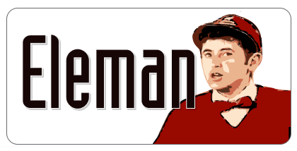

   
  Fully dockerized job board app that uses airtable as database.

# Features

 * Eleman is ready to run with very few configurations.
 * Eleman has caching mechanism that copies Airtable data to local
   database to avoid hitting API limitations.
 * Eleman has built-in filtering mechanism that allows users to list jobs
   by tags, companies and search words.
 * Eleman Support for multiple fields like description, requirements,
   responsibilities etc.
 * Eleman has built-in Markdown support to show rich text formatted fields
   in Airtable.
 * Eleman Has simple and modest frontend tailored with tailwindcss framework.

# How to Use?

If your need a simple job board there's a X steps to run.

1. Clone [this](https://airtable.com/invite/l?inviteId=invTx1QDnX5EZ5QVk&inviteToken=414fc3ad1a3f8e069570a78d111011743e85b98ff701da04694337c35e68e375) airtable base on your workspace.
2. Get your airtable api key and copied base id. ([1](https://support.airtable.com/hc/en-us/articles/360056249614-Creating-a-read-only-API-key), [2](https://airtable.com/api)).
4. Create your config file by  [config file](settings.env.example) on your local as settings.env
   and change it for your needs. 
5. Run docker command:
  
      docker run -p 80:80 --env-file .settings.env miratcan/eleman

 # How to Contribute?
 
 I appreciate all kinds of help for this project. Please check issues section
 and 
  
## How to build docker image?

    docker build -f docker/Dockerfile -t eleman .

## How to run development server?

Go to web app directory and create virtualenv with given commands:

    $ cd web/
    $ python3 -m venv venv

Install Python packages to that environment:

    $ source venv/bin/activate
    $ pip install -r requirements.txt
    
Run synch command, you must set AIRTABLE_BASE_KEY and AIRTABLE_API_KEY
environment variables when running.

    $ AIRTABLE_BASE_KEY=foo AIRTABLE_API_KEY=bar flask synch

After that you can run project:

    $ flask run

## How to Change Styles?

This project is using tailwindcss compiler to compile it's css file. You have
to install tailwindcss node package globally.

    npm install -g tailwindcss
    
After that you can make your changes on assets/web.css and compile it with
 given command:
 
     flask compile-css

> Note: Do not change web.css file on static folder directly. It's being
   generated from compiling process of assets/web.css  
